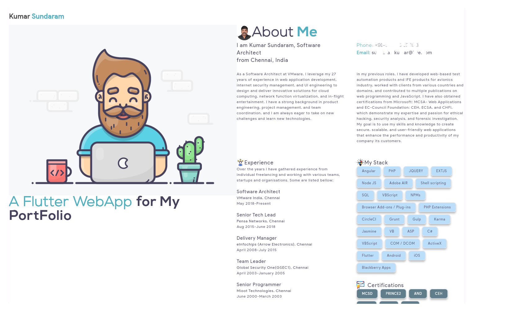

# kumarsundaram_portfolio

A Flutter WebApp For my Portfolio.

## Screenshot

## TODO

- Add screen resolution support
- Split up Skills into sections

## Notes

- You can add your portfolio data in the strings.dart file
- you can choose any image available in the assets folder or use your own
